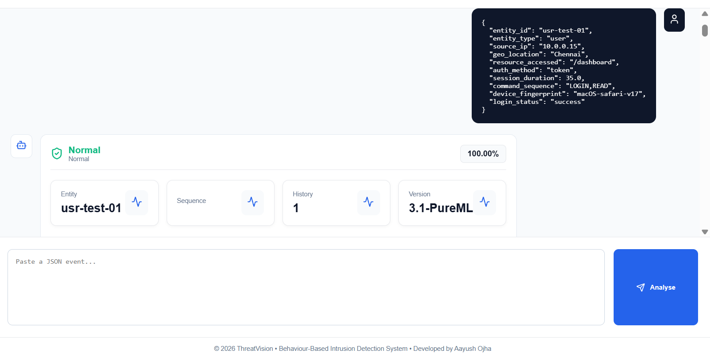
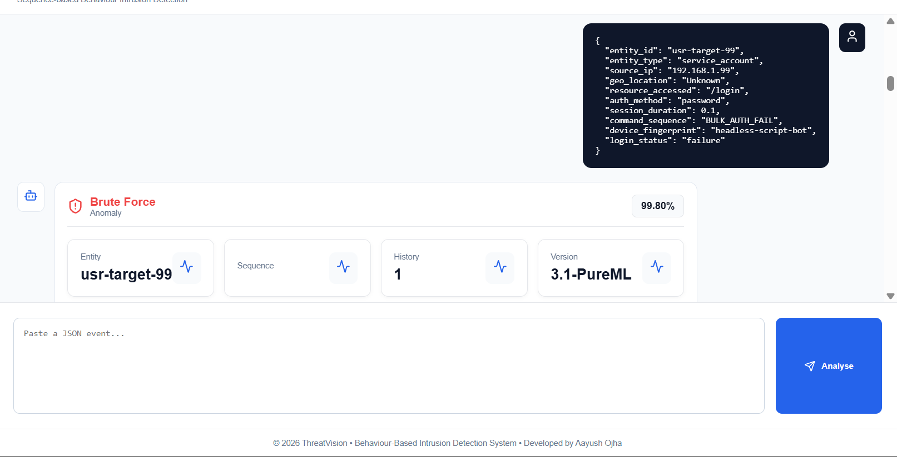
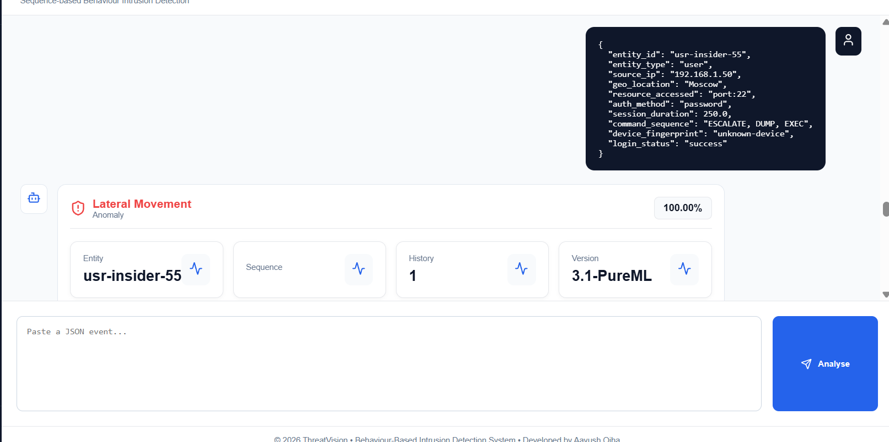
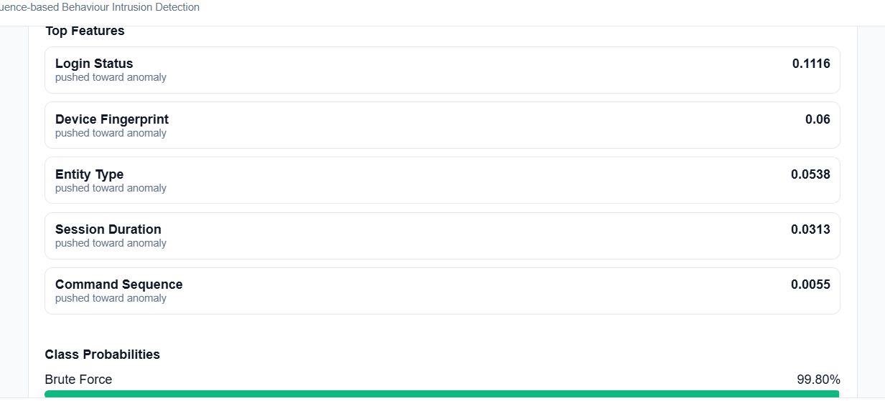

# Behaviour-Based Intrusion Detection System (IDS)

An enterprise-grade, real-time **Behaviour-Based Intrusion Detection System (IDS)** powered by **Deep Learning (LSTM)** and **Explainable AI (SHAP)**. The system learns behavioural patterns of users, service accounts, and edge devices, detects anomalous activities in real time, classifies cyber attack vectors, and provides an interactive Security Operations Center (SOC) dashboard for analysts.

---

# Architecture

- **Synthetic Data Generator** for enterprise access logs.
- **LSTM-based Behaviour Model** for sequence learning.
- **Flask REST API** for real-time prediction.
- **React Dashboard** for SOC monitoring.
- **SHAP Explainability** for prediction reasoning.

---

# Features

- Behaviour-Based Intrusion Detection
- Deep Learning (LSTM)
- Real-Time Prediction API
- Multi-Class Attack Classification
- Explainable AI (SHAP)
- Cold Start Handling
- Concept Drift Support
- Interactive SOC Dashboard
- Behaviour History Tracking
- Synthetic Enterprise Dataset Generator

---

# Tech Stack

| Category | Technology |
|-----------|------------|
| Frontend | React |
| Backend | Flask, Flask-CORS |
| Machine Learning | TensorFlow, Keras, Scikit-Learn |
| Explainability | SHAP |
| Data Processing | Pandas, NumPy, Joblib |
| Dataset Generation | Faker |

---

# Project Structure

```text
behaviour-ids/
│
├── assets/
│   ├── normal_prediction.png
│   ├── brute_force_prediction.png
│   └── lateral_movement_prediction.png
│
├── data-generator/
│   └── generator.py
│
├── ml-engine/
│   ├── train.py
│   └── app.py
│
├── models/
│
└── README.md
```

---

# Installation

## Install Dependencies

```bash
pip install tensorflow scikit-learn pandas numpy flask flask-cors shap faker joblib
```

---

## Generate Dataset

```bash
cd data-generator
python generator.py
```

---

## Train Model

```bash
cd ../ml-engine
python train.py
```

---

## Start Backend

```bash
python app.py
```

Server starts at

```
http://localhost:5000
```

---

# API Endpoints

| Method | Endpoint | Description |
|---------|----------|-------------|
| GET | `/` | API Information |
| GET | `/health` | Health Check |
| GET | `/api/status` | Runtime Status |
| POST | `/api/analyze` | Analyse Behaviour Event |
| GET | `/api/prediction/<entity_id>` | Latest Prediction |
| POST | `/api/drift-retrain` | Retrain Model |
| POST | `/api/reset` | Reset Runtime Cache |

---

# Example Test Cases

## 1. Normal User Behaviour

### Input

```json
{
  "entity_id": "usr-test-01",
  "entity_type": "user",
  "source_ip": "10.0.0.15",
  "geo_location": "Chennai",
  "resource_accessed": "/dashboard",
  "auth_method": "token",
  "session_duration": 35.0,
  "command_sequence": "LOGIN,READ",
  "device_fingerprint": "macOS-safari-v17",
  "login_status": "success"
}
```

### Expected Prediction

✅ **Normal Behaviour**

### Reasoning

The activity closely matches a legitimate employee session.

- Standard internal IP address
- Valid authentication token
- Typical dashboard access
- Normal session duration
- Expected command sequence (`LOGIN → READ`)
- Known trusted device
- Successful authentication

Therefore,the LSTM recognises this sequence as normal behaviour and assigns a **100% Normal** confidence.

### Dashboard Output

<p align="center">

</p>

---

## 2. Brute Force Attack

### Input

```json
{
  "entity_id": "usr-target-99",
  "entity_type": "service_account",
  "source_ip": "192.168.1.99",
  "geo_location": "Unknown",
  "resource_accessed": "/login",
  "auth_method": "password",
  "session_duration": 0.1,
  "command_sequence": "BULK_AUTH_FAIL",
  "device_fingerprint": "headless-script-bot",
  "login_status": "failure"
}
```

### Expected Prediction

🚨 **Brute Force Attack**

### Reasoning

Multiple behavioural indicators resemble automated password attacks.

- Unknown location
- Password authentication
- Extremely short session
- Bulk authentication failures
- Headless bot fingerprint
- Failed login

These features strongly match brute-force attack behaviour, resulting in a prediction confidence of approximately **99.8%**.

### Dashboard Output

<p align="center">

</p>

---

## 3. Lateral Movement Attack

### Input

```json
{
  "entity_id": "usr-insider-55",
  "entity_type": "user",
  "source_ip": "192.168.1.50",
  "geo_location": "Moscow",
  "resource_accessed": "port_22",
  "auth_method": "password",
  "session_duration": 250.0,
  "command_sequence": "ESCALATE, DUMP, EXEC",
  "device_fingerprint": "unknown-device",
  "login_status": "success"
}
```

### Expected Prediction

🚨 **Lateral Movement**

### Reasoning

This behaviour strongly resembles an attacker moving laterally within a compromised network.

Indicators include:

- Unusual geographic location
- SSH (Port 22) access
- Privilege escalation attempts
- Credential dumping activity
- Remote execution commands
- Unknown device fingerprint
- Long interactive session

The sequence significantly deviates from historical user behaviour, causing the LSTM model to classify it as **Lateral Movement** with **100% confidence**.

### Dashboard Output

<p align="center">

</p>

---

# Technical Highlights

## Extreme Class Imbalance

The dataset contains approximately **1.5% attack events**.

To prevent the model from becoming biased toward normal behaviour, balanced class weights are applied during training.

---

## Cold Start Handling

New users or devices often have no behavioural history.

The backend automatically pads missing sequences, enabling immediate inference without requiring historical activity.

---

## Concept Drift

Behaviour patterns naturally evolve over time.

The system includes a dedicated endpoint

```
POST /api/drift-retrain
```

allowing retraining whenever behaviour distributions shift significantly.

---

---

## Explainable AI (SHAP)

The system uses **SHAP (SHapley Additive exPlanations)** to highlight the features that contributed most to each prediction, enabling analysts to understand why an event was classified as normal or anomalous.

### Example

<p align="center">
  
</p>


Typical influential features include:

- Session Duration
- Resource Accessed
- Command Sequence
- Authentication Method
- Device Fingerprint
- Geo Location
- Login Status

---

# Future Enhancements

- Kafka Event Streaming
- Redis Behaviour Cache
- Docker Deployment
- Kubernetes Scaling
- JWT Authentication
- WebSocket Live Alerts
- Prometheus Monitoring
- Grafana Dashboards
- SIEM Integration (Splunk, Elastic, Wazuh)

---

# License

This project is developed for academic, research, and educational purposes.